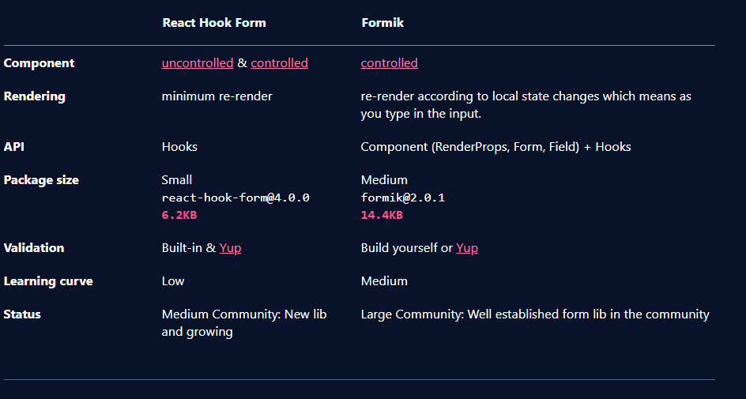

## Form Experiements

This is a study on forms in react.  It assumes using hooks for the examples without a library.  

The short comings of the examples are validation and error handling.

This leads me to be interested in a form libaray that has built in validation (but also makes working with forms easier in general)

The two libraries that caught my attention were `formik` and `react-hook-form`.  

I found this helpful breakout and comparison [here](https://blog.bitsrc.io/react-hook-form-vs-formik-form-builder-library-for-react-23ed559fdae)g
